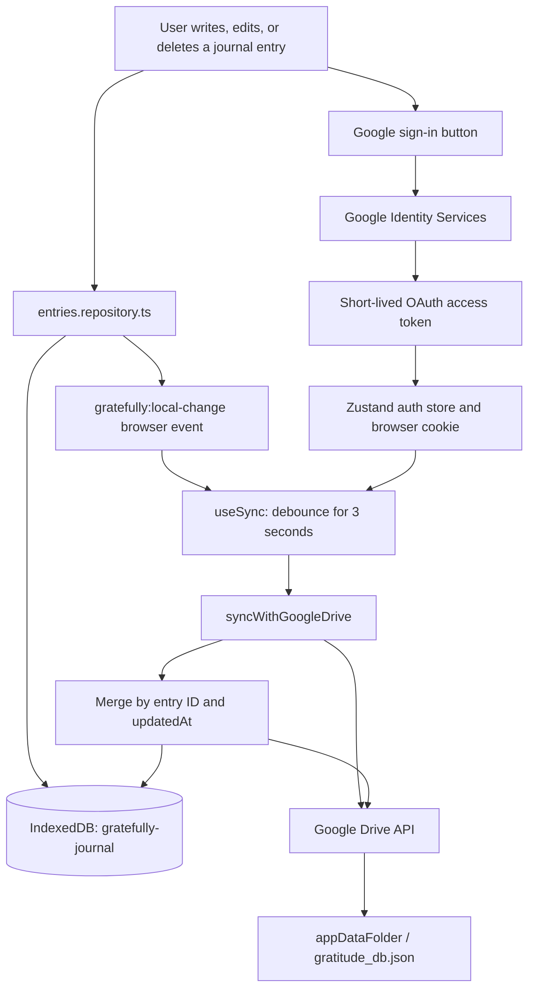
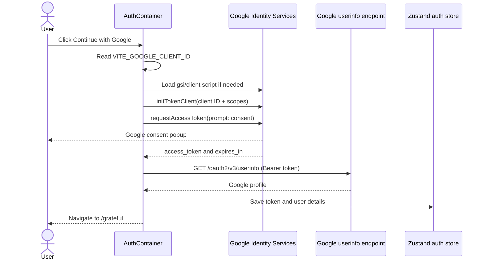
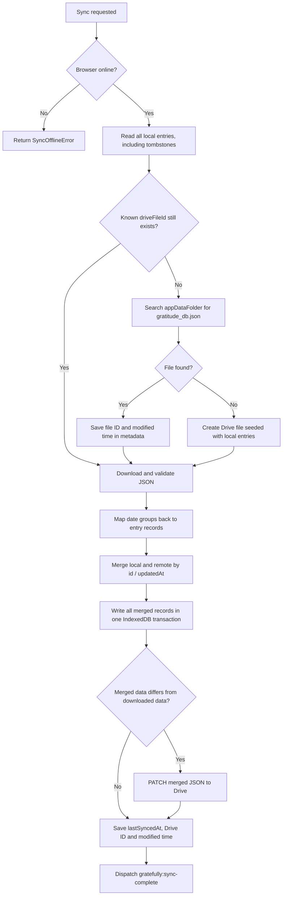

# Gratefully: Authentication, Local Data, and Google Drive Sync

This guide explains the architecture currently implemented in this repository. It is written as a learning map: start with the diagrams, then follow the linked files in the order shown.

> **Core idea:** Gratefully is a **local-first** journal. The browser saves an entry to IndexedDB first, so the journal works without a network connection. When the user is signed in and online, the app synchronizes a JSON backup with the user's private Google Drive application-data folder.

---

## 1. Stack and responsibilities

| Layer | Technology in this app | Why it is used |
| --- | --- | --- |
| UI | React 19, TypeScript, Tailwind CSS, shadcn/Radix UI | Component-based UI, type checking, and reusable accessible UI primitives. |
| Build | Vite | Fast local development and production bundling. |
| Routing | TanStack Router | Typed client-side routes. |
| UI state | Zustand | Holds the current user and Google access token so non-React service code can read it. |
| Local persistence | Browser IndexedDB (native API) | Async, structured, durable browser storage; unlike `localStorage`, it is suitable for a growing collection of records. |
| Cloud sync | Google Identity Services + Google Drive REST API | Lets users use their Google account and retain ownership of their data without a custom backend. |
| Feedback | Sonner | Toast messages for sign-in and journal actions. |

### Main source folders

```text
src/
├── features/auth/          # Google sign-in screen and OAuth request
├── db/                     # IndexedDB schema and repositories
├── sync/                   # JSON mapping, conflict merge, sync orchestration
├── services/drive.service.ts # Google Drive HTTP requests
├── hooks/use-sync.ts       # React lifecycle/event-based sync scheduler
├── stores/auth-store.ts    # Zustand auth state + cookie persistence
└── types/                  # Shared TypeScript data contracts
```

---

## 2. The architecture at a glance



There is no application backend in this path. The browser talks directly to Google. That makes the system simpler and avoids operating a server, but means browser-side security and token handling are especially important.

---

## 3. Google sign-in: authentication *and* authorization

### Important concepts

These terms are related but different:

- **Authentication:** “Who is this user?” The app calls Google's user-info endpoint and receives identity data such as `sub`, email, display name, and picture.
- **Authorization:** “What may this app do?” Google returns an OAuth **access token** whose scopes permit the Drive calls.
- **Access token:** A short-lived bearer credential. Any code that obtains it can make the permitted Drive requests as the user until it expires.
- **Scope:** A permission requested during consent. Smaller scopes follow the principle of least privilege.

### Current sign-in sequence

The code is in [`src/features/auth/container/index.tsx`](../src/features/auth/container/index.tsx).



The app dynamically loads `https://accounts.google.com/gsi/client`, creates an OAuth token client with `google.accounts.oauth2.initTokenClient`, and asks for a token with `requestAccessToken`.

### Requested scopes

```ts
const GOOGLE_SCOPE = [
  'openid',
  'email',
  'profile',
  'https://www.googleapis.com/auth/drive.appdata',
].join(' ')
```

| Scope | Purpose in the current app |
| --- | --- |
| `openid`, `email`, `profile` | Lets the app identify and display the Google user. |
| `drive.appdata` | Required for the app's `appDataFolder`, a hidden Google Drive area intended for application data. This is the only Drive scope required by the current sync design. |

### Where the session is stored

[`src/stores/auth-store.ts`](../src/stores/auth-store.ts) stores:

- `auth-user`: serialized profile data, including an `exp` timestamp.
- `thisisjustarandomstring`: the OAuth access token.

Both are stored using the project cookie helpers and mirrored in the Zustand store. [`src/utils/driveHelpers.ts`](../src/utils/driveHelpers.ts) is a small adapter that lets Drive service code access the current token outside React.

### What happens when the token expires?

The expiration timestamp is saved, but the code does **not** currently check it before syncing or silently refresh the token. A Drive request may return `401`, which becomes a `DriveServiceError` with code `AUTHENTICATION`.

This is normal for the Google token-client approach: it provides an access token, not a long-lived token stored by the application. A robust next step would be to request a new access token before sync when it is near expiry, or when Drive returns `401`—while respecting Google’s user-interaction and consent rules.

### Security notes

- A `VITE_*` client ID is public configuration, not a secret. Put `VITE_GOOGLE_CLIENT_ID` in a local `.env` file and configure its allowed JavaScript origins in Google Cloud Console.
- **Do not put a Google client secret in this frontend.** Browser code and Vite environment variables are visible to users.
- Cookies set from JavaScript cannot be `HttpOnly`. Therefore an XSS vulnerability could expose the access token. Avoid untrusted HTML, keep dependencies current, and add a strict Content Security Policy when deploying.
- The current token cookie appears to be persistent. Keeping bearer tokens only in memory reduces persistence but requires sign-in again after a reload. This is a security/usability trade-off to decide deliberately.
- Sign-out must clear both the auth state and cookies. The Zustand store’s `reset()` does this; verify the sign-out component calls it.

---

## 4. IndexedDB: the offline source of truth

### Why IndexedDB instead of `localStorage`?

`localStorage` is synchronous, string-only, and small. It can block the UI and is awkward for querying collections. IndexedDB is asynchronous, stores structured JavaScript data, supports indexes and transactions, and survives page refreshes.

In this project, IndexedDB is the **local source of truth**. Screens read journal entries from it even if Drive is unavailable.

### Database schema

[`src/db/db.ts`](../src/db/db.ts) opens one database:

```ts
const DATABASE_NAME = 'gratefully-journal'
const DATABASE_VERSION = 1
```

| Object store | Key | Extra index | Contents |
| --- | --- | --- | --- |
| `entries` | `id` | non-unique `date` index | Journal records, including deleted records. |
| `metadata` | `key` | — | One record keyed as `sync` that remembers sync state. |

The `onupgradeneeded` callback is IndexedDB’s migration point. Whenever the data shape changes, increment `DATABASE_VERSION` and write a careful migration there. Do not modify an already-deployed schema without increasing its version.

### Entry record

Defined in [`src/types/gratefully.ts`](../src/types/gratefully.ts):

```ts
type GratefullyEntry = {
  id: string              // crypto.randomUUID(): stable identity across devices
  date: string            // YYYY-MM-DD
  content: string
  createdAt: string       // ISO 8601 timestamp
  updatedAt: string       // ISO 8601 timestamp used for conflict resolution
  deletedAt: string | null // non-null means this is a deletion tombstone
}
```

### CRUD flow

[`src/db/entries.repository.ts`](../src/db/entries.repository.ts) is the persistence boundary. UI code should call its functions instead of directly calling IndexedDB.

```text
createEntry(input)
  ├─ validate YYYY-MM-DD
  ├─ create UUID and timestamps
  ├─ add entry to IndexedDB
  └─ markLocalChange()

updateEntry(id, changes)
  ├─ preserve id and createdAt
  ├─ write a new updatedAt
  ├─ put entry into IndexedDB
  └─ markLocalChange()

softDeleteEntry(id)
  ├─ keep the record
  ├─ set updatedAt and deletedAt
  ├─ put tombstone into IndexedDB
  └─ markLocalChange()
```

`markLocalChange()` updates metadata and sends a browser event named `gratefully:local-change`. That event is how the storage layer tells the sync hook, “there is new local work to upload.”

### Why soft delete instead of `delete()`?

The app retains a deleted record as a **tombstone** (`deletedAt` is set). This is essential for synchronization:

1. Device A deletes an entry while offline.
2. Device B still has the old entry.
3. If A removed the record entirely, B’s later upload could bring it back.
4. With a newer tombstone, the merge recognizes the deletion as the newest state and propagates it to every device.

Active UI lists filter out tombstones with `deletedAt === null`; sync intentionally includes them.

### Sync metadata record

```ts
type SyncMetadata = {
  key: 'sync'
  schemaVersion: number
  lastSyncedAt: string | null
  lastLocalChangeAt: string | null
  driveModifiedTime: string | null
  driveFileId: string | null
}
```

Meaning:

- `driveFileId` avoids searching Drive every sync once the remote file is known.
- `driveModifiedTime` records Drive’s last returned modification time.
- `lastSyncedAt` is a local informational timestamp.
- `lastLocalChangeAt` records a local mutation and accompanies the local-change event.
- `schemaVersion` reserves room for future metadata migrations.

**Current behavior note:** `driveModifiedTime` and `lastLocalChangeAt` are persisted but not used to skip downloads or to implement optimistic concurrency. Each sync still downloads and merges the complete JSON file. That is simple and correct for a small journal, but not optimized for a large dataset.

---

## 5. Google Drive storage

[`src/services/drive.service.ts`](../src/services/drive.service.ts) is the only layer that sends Drive HTTP requests. It adds this header to every request:

```http
Authorization: Bearer <Google access token>
```

The file is named `gratitude_db.json`, has MIME type `application/json`, and is created in `appDataFolder`:

```json
{
  "name": "gratitude_db.json",
  "mimeType": "application/json",
  "parents": ["appDataFolder"]
}
```

`appDataFolder` is private application storage in the user’s Drive. It does not appear in the regular Drive UI and is intended for app-managed files. The user still owns the Google account and data, but they do not normally browse this file like a document in “My Drive.”

The Drive service:

1. Looks up the database by filename in `appDataFolder`.
2. Reuses the oldest matching legacy duplicate instead of creating another file.
3. Downloads file content with `?alt=media`.
4. Uses multipart upload to create or patch the JSON file.
5. Validates HTTP errors and converts them to typed `DriveServiceError` values such as `AUTHENTICATION`, `NOT_FOUND`, and `NETWORK`.

---

## 6. The sync algorithm

The orchestration is in [`src/sync/sync.service.ts`](../src/sync/sync.service.ts).



### When sync runs

[`src/hooks/use-sync.ts`](../src/hooks/use-sync.ts) is mounted by [`src/components/root-component.tsx`](../src/components/root-component.tsx), so it is always active while the app is running.

It requests sync:

- once after an access token becomes available (sign-in),
- three seconds after a local create, update, or delete event (debounced),
- when the browser comes back online,
- when the document becomes visible again.

The 3-second debounce prevents multiple writes while the user makes several changes close together. `syncWithGoogleDrive()` also uses an in-memory `activeSync` promise so concurrent triggers in the **same browser tab** share one in-flight request.

### Remote file format

[`src/sync/mapper.ts`](../src/sync/mapper.ts) stores entries grouped by date. The date is the object key, so it is omitted from each nested entry:

```json
{
  "metadata": {
    "version": 1,
    "updatedAt": "2026-09-14T10:00:00.000Z"
  },
  "entries": {
    "2026-09-14": [
      {
        "id": "7d6...",
        "content": "I am grateful for my family.",
        "createdAt": "2026-09-14T09:00:00.000Z",
        "updatedAt": "2026-09-14T10:00:00.000Z",
        "deletedAt": null
      }
    ]
  }
}
```

The parser validates the structure, dates, ISO timestamps, required fields, and duplicate IDs **before** IndexedDB is modified. This protects local data from treating a failed or malformed download as an empty cloud database.

### Conflict resolution

[`src/sync/merge.ts`](../src/sync/merge.ts) is intentionally small:

```ts
for (const entry of [...localEntries, ...remoteEntries]) {
  const current = merged.get(entry.id)
  if (!current || entry.updatedAt > current.updatedAt) {
    merged.set(entry.id, { ...entry })
  }
}
```

Rules:

1. Match records by their stable UUID (`id`).
2. Keep whichever record has the later `updatedAt` timestamp.
3. If timestamps are equal, keep the local record, because local entries are processed first.
4. Tombstones participate just like normal records, so a newer deletion wins.
5. Upload only when a normalized comparison shows the merged entries differ from the downloaded remote entries. The comparison intentionally ignores the file-level `metadata.updatedAt`, avoiding pointless uploads caused only by a generated timestamp.

This is **last-write-wins at the whole-entry level**. If two devices edit different words in the same entry while offline, the newer edit replaces the other—not a line-by-line merge.

### Example: offline conflict

```text
Initial: entry A updatedAt = 10:00, content = "Family"

Device 1 offline: changes it to "Family and health" at 10:05
Device 2 offline: changes it to "Family, friends" at 10:07

When either device syncs:
- both versions have id = A
- 10:07 is newer than 10:05
- the 10:07 version wins and is uploaded
```

---

## 7. Why this strategy is a good fit

### Benefits

- **Offline-first UX:** writing a journal entry does not wait for Google or a network.
- **Fast UI:** reading local IndexedDB is generally faster and more reliable than fetching Drive for each screen.
- **User-owned cloud backup:** Drive is tied to the user’s Google account rather than a database you must host.
- **Low operational complexity:** no custom auth server, API, database, deployment, backups, or billing are needed for this feature.
- **Portable data:** the remote representation is JSON, which is easy to inspect, export, and migrate.
- **Reasonable sync behavior for a small app:** full-file download + deterministic merge is far easier to reason about than building a server-side sync protocol.
- **Deletion safety:** tombstones avoid accidental revival of deleted entries across devices.

### Trade-offs and current limitations

| Area | Current choice | Consequence / improvement path |
| --- | --- | --- |
| Conflict handling | Whole-entry last-write-wins | Simple, but concurrent edits can overwrite each other. Add revision history, explicit conflicts, or a CRDT only if the product needs it. |
| Timestamp authority | Device-generated `updatedAt` | Incorrect device clocks can choose the wrong winner. A server timestamp or logical revision counter is stronger. |
| Remote storage | One complete JSON file | Fine for a small journal; becomes inefficient and contention-prone as entries grow. Consider chunked files or a backend later. |
| Upload concurrency | One active sync per tab | Separate tabs/devices can still race. Drive ETags / `If-Match` or revision checks would detect conflicting remote writes. |
| Metadata | File modified time is remembered | It is not yet used to avoid downloads or guard uploads. |
| Token lifecycle | Persisted short-lived access token | The app needs a deliberate refresh/re-authentication experience after expiration. |
| Encryption | Plain JSON in IndexedDB and Drive | Google protects Drive access, but the application does not add end-to-end encryption. Client-side encryption requires careful key recovery design. |
| Deletion retention | Tombstones retained forever | They keep sync correct, but the file can grow. Purge only after a deliberate multi-device retention policy. |

---

## 8. Recommended reading order in the code

1. [`src/types/gratefully.ts`](../src/types/gratefully.ts) — learn the entry and sync metadata shapes.
2. [`src/db/db.ts`](../src/db/db.ts) — see the IndexedDB schema and migrations.
3. [`src/db/entries.repository.ts`](../src/db/entries.repository.ts) — understand local CRUD and tombstones.
4. [`src/db/metadata.repository.ts`](../src/db/metadata.repository.ts) — understand the local-change event and remembered Drive file details.
5. [`src/features/auth/container/index.tsx`](../src/features/auth/container/index.tsx) — trace OAuth token acquisition.
6. [`src/stores/auth-store.ts`](../src/stores/auth-store.ts) and [`src/utils/driveHelpers.ts`](../src/utils/driveHelpers.ts) — follow how Drive obtains the token.
7. [`src/services/drive.service.ts`](../src/services/drive.service.ts) — inspect the REST calls and multipart upload implementation.
8. [`src/sync/mapper.ts`](../src/sync/mapper.ts), [`src/sync/merge.ts`](../src/sync/merge.ts), and [`src/sync/normalize.ts`](../src/sync/normalize.ts) — learn transformations and conflict rules.
9. [`src/sync/sync.service.ts`](../src/sync/sync.service.ts) — read the whole algorithm end-to-end.
10. [`src/hooks/use-sync.ts`](../src/hooks/use-sync.ts) — see when React triggers synchronization.
11. [`src/sync/mapper.test.ts`](../src/sync/mapper.test.ts) — see executable examples for mapping and tombstone merge behavior.

---

## 9. Safe experiments to learn by doing

1. **Inspect IndexedDB:** In browser DevTools, open **Application → IndexedDB → `gratefully-journal`**. Create, edit, and delete an entry; watch the `entries` and `metadata` stores change.
2. **Test offline-first behavior:** Use DevTools Network → Offline, create an entry, reload, then reconnect. The entry should exist locally first and sync once online.
3. **Watch sync logs:** Run `pnpm dev`; development mode logs `[sync]` events to the console.
4. **Study the payload:** After a sync, use Google’s Drive API Explorer or an authenticated request to inspect the app-data JSON. Never paste the access token into an untrusted site.
5. **Simulate a conflict:** Use two browser profiles signed into the same account, change the same entry while each is offline, reconnect both, and compare the `updatedAt` values.
6. **Add a test before changing merge logic:** `src/sync/mapper.test.ts` is the correct place to protect the merge rules. Run `pnpm test` after changing it.

---

## 10. Practical checklist before production

- [ ] Create an OAuth **Web application** client in Google Cloud Console.
- [ ] Add every development and production origin to its authorized JavaScript origins.
- [ ] Enable the Google Drive API in the same Google Cloud project.
- [ ] Configure `VITE_GOOGLE_CLIENT_ID` locally and in the deployment environment; never commit secrets.
- [ ] Design re-authorization/token-expiry UX and test a Drive `401` response.
- [ ] Add a Content Security Policy and XSS defenses before storing bearer tokens in JavaScript-readable storage.
- [ ] Test sign-in, offline edits, reconnect sync, deletion propagation, malformed cloud JSON, and two-device conflicts.
- [ ] Decide how users can export, restore, and permanently delete their journal data.
- [ ] Increment the IndexedDB version and write migration code whenever the local schema changes.

---

## 11. Short glossary

| Term | Meaning |
| --- | --- |
| **Bearer token** | A credential that grants access to whoever presents it. Protect it like a password. |
| **CRUD** | Create, read, update, and delete. |
| **Debounce** | Wait briefly after repeated events, then perform one action. |
| **IndexedDB transaction** | A group of browser database operations that completes together or fails together. |
| **Local-first** | Save locally immediately; synchronize remotely later. |
| **OAuth 2.0** | Delegated authorization standard used to request access to Google APIs. |
| **Tombstone** | A retained deletion record that lets sync propagate a deletion. |
| **UUID** | A globally unique identifier used here as the stable entry ID. |
| **XSS** | Cross-site scripting: injected JavaScript that can read browser-accessible data. |

---

## The most important mental model

Think of each device’s IndexedDB database as a working copy of the journal and the Drive JSON file as a shared backup/meeting point. Every sync reads both copies, resolves each entry by its ID and modification time, writes the resolved result locally, and then updates Drive only if Drive is behind. The design favors availability and simplicity over perfect multi-device collaborative editing.
