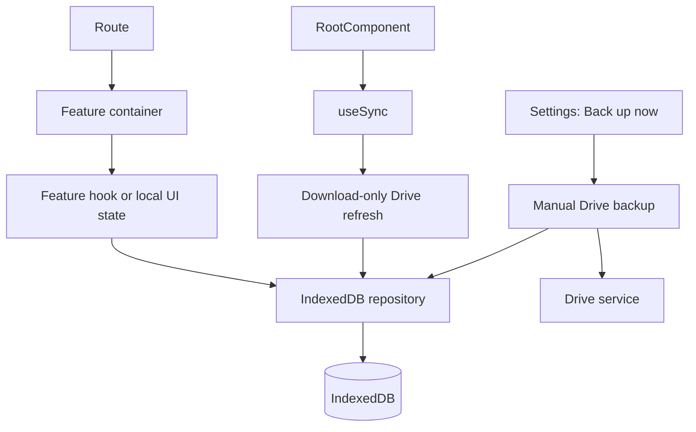
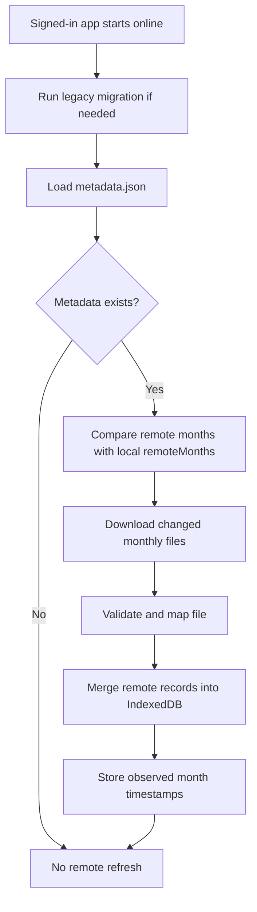
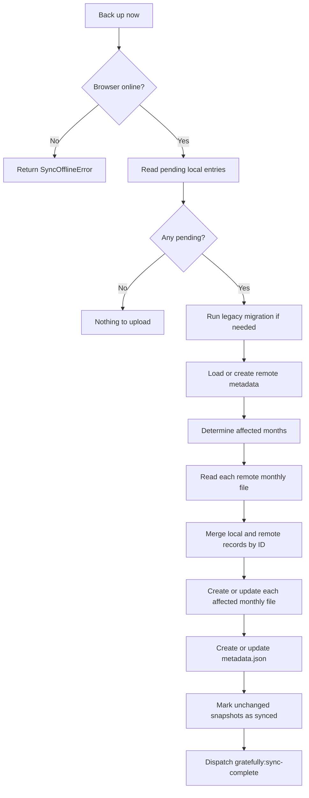

# Gratefully architecture guide

This document describes the architecture implemented in this repository. Gratefully is a **local-first gratitude journal**: IndexedDB is the working copy used by the UI, while Google Drive app-data storage is an optional, user-owned backup and cross-device synchronization target.

> **Mental model:** local writes are immediate and durable in the browser. A Google Drive refresh may bring newer remote records into IndexedDB; a manual backup uploads only local records that are still pending.

---

## Stack and ownership

| Concern | Implementation | Responsibility |
| --- | --- | --- |
| UI | React 19, TypeScript, Tailwind CSS, shadcn/Radix | Screens, accessible primitives, and feature components. |
| Build | Vite | Development server and production bundle. |
| Routing | TanStack Router | File-based typed routes under `src/routes/`. |
| Server/cache state | TanStack Query | Shared query configuration and async request tooling. |
| App state | Zustand | Persisted Google profile, access token, expiry, and Drive connection status. |
| Local persistence | Native IndexedDB | Offline journal records and sync metadata. |
| Cloud backup | Google Identity Services and Google Drive REST API | OAuth access tokens and private app-data JSON files. |
| Localization | i18next / react-i18next | English and Indonesian UI translations. |

### Source layout

```text
src/
├── routes/                 # TanStack Router route definitions
├── components/             # Shared UI, root shell, navigation, layout
├── features/               # Feature containers, components, and feature hooks
│   ├── auth/               # Google sign-in
│   ├── grateful/           # Write and view recent entries
│   ├── journey/            # Browse, filter, edit, and delete entries
│   ├── settings/           # Account, language, and backup controls
│   └── Dashboard/          # Journal statistics and streak UI
├── db/                     # IndexedDB database, repositories, and transactions
├── sync/                   # Monthly-file mapping, merge, refresh, and backup
├── services/               # Google token lifecycle and Drive HTTP boundary
├── stores/                 # Zustand state
├── hooks/                  # Cross-feature React hooks, including useSync
├── types/                  # Shared domain and external API contracts
├── i18n/                   # Localization initialization and dictionaries
└── styles/                 # Application styles and theme tokens
```

## Application composition

`src/main.tsx` creates the TanStack Query client and TanStack Router, then wraps the router with `QueryClientProvider` and `DirectionProvider`.

`src/routes/__root.tsx` is the session guard. Except for `/auth`, routes require a persisted `auth.user`. It intentionally does **not** require a valid Drive token: an expired or unavailable token must not lock a user out of their local journal.

`src/components/root-component.tsx` provides the shared mobile shell, greeting, bottom navigation, toast host, developer tools, and `useSync()`.

| Route | Feature container | Purpose |
| --- | --- | --- |
| `/auth` | `AuthContainer` | Interactive Google authorization and profile lookup. |
| `/` | `DashboardContainer` | Journal-derived dashboard and streaks. |
| `/grateful` | `GratefulContainer` | Create, edit, and show recent gratitude entries. |
| `/journey` | `JourneyContainer` | Search, filter, inspect, edit, and delete the complete journal. |
| `/settings` | `SettingsContainer` | Account preferences and Drive backup controls. |

Feature containers coordinate feature-specific hooks and presentational components. They call repository functions such as `createEntry()` and `getActiveEntries()`; UI components do not call IndexedDB or Drive APIs directly.



## Authentication and Drive authorization

Google Identity Services (GIS) supplies a short-lived OAuth access token. The auth container requests consent, calls Google’s user-info endpoint with that token, persists the profile in the Zustand store, and navigates to `/grateful`.

The requested scope is deliberately limited to identity information and app-private Drive storage:

```ts
const GOOGLE_SCOPE = [
  'openid',
  'email',
  'profile',
  'https://www.googleapis.com/auth/drive.appdata',
].join(' ')
```

`src/services/google-token.service.ts` owns token acquisition:

- loads or reuses the GIS client;
- caches one in-flight token request so concurrent callers do not open multiple prompts;
- considers a token invalid in its final 60 seconds;
- stores `accessToken` and `expiresAt` together through `auth-store`;
- clears unavailable/revoked credentials and exposes `authenticated`, `reauthorizing`, `reconnection-required`, or `unauthenticated` status.

The persisted profile (`auth.user`) is the local application session; the short-lived Drive token is separate. If a profile exists but the token is absent or expired, the user remains in the local journal and Drive is `reconnection-required`.

Background Drive operations call token acquisition with `interactive: false`. GIS is invoked with `prompt: 'none'`, so silent recovery either succeeds without UI or fails and marks Drive as requiring reconnection. Only the Google sign-in and Settings **Reconnect Google** button call the `interactive: true` path, which may present the account chooser.

`src/services/drive.service.ts` is the only Drive HTTP boundary. It adds the bearer token, converts network/API failures to `DriveServiceError`, and handles a Drive `401` by invalidating the token, attempting one **non-interactive** replacement token, and retrying the request once. A silent recovery failure aborts the operation without opening GIS UI; it does not retry `403` responses as an authorization loop.

The user profile, token, and expiry are persisted in browser cookies by `src/stores/auth-store.ts`. Because JavaScript-written cookies are not `HttpOnly`, the token is exposed to any successful XSS attack. `VITE_GOOGLE_CLIENT_ID` is public configuration, but no Google client secret belongs in this frontend. Deploy with a restrictive Content Security Policy and standard XSS defenses.

## Local data model

`src/db/db.ts` opens the `gratefully-journal` IndexedDB database at version 2.

| Object store | Key | Contents |
| --- | --- | --- |
| `entries` | `id` | Active records, deletion tombstones, and local-only backup state. It has a non-unique `date` index. |
| `metadata` | `key` | The single `sync` record describing local and observed remote sync state. |

### Journal entries

`src/types/gratefully.ts` defines the local entry contract:

```ts
type GratefullyEntry = {
  id: string
  date: string                 // YYYY-MM-DD
  content: string
  createdAt: string            // ISO timestamp
  updatedAt: string            // conflict-resolution timestamp
  deletedAt: string | null     // a non-null value is a tombstone
  syncStatus: 'synced' | 'pending'
  pendingMonths?: string[]
  previousDate?: string | null
}
```

`syncStatus`, `pendingMonths`, and `previousDate` exist only locally and are never serialized into Drive files.

`src/db/entries.repository.ts` is the persistence boundary:

- **Create** validates the date, creates a UUID/timestamps, and writes a `pending` entry.
- **Update** preserves `id` and `createdAt`, changes `updatedAt`, and marks the entry pending.
- **Delete** is a soft delete: it writes `deletedAt` instead of removing the record.
- **Move between months** remembers both the old and new month in `pendingMonths`. During backup, a synthetic tombstone is written to the old month so the record cannot reappear there remotely.
- **Acknowledge** changes a pending snapshot to `synced` only if its `updatedAt` still matches. An edit made while Drive I/O was in progress therefore stays pending for the next backup.

Every local mutation calls `markLocalChange()` in `metadata.repository.ts`. That updates `lastLocalChangeAt` and dispatches the browser event `gratefully:local-change`. The current application uses this event to refresh displayed sync state; it does **not** automatically upload changes.

### Sync metadata

```ts
type SyncMetadata = {
  key: 'sync'
  schemaVersion: number
  lastSyncedAt: string | null
  lastLocalChangeAt: string | null
  remoteMonths: Record<string, string>
}
```

`remoteMonths` maps a `YYYY-MM` key to the remote monthly file’s last observed logical `updatedAt`. It lets a startup refresh download only the months that changed since the prior refresh.

## Drive storage format

Google Drive files live in the signed-in account’s `appDataFolder`, which is private application storage rather than a normal file visible in My Drive.

The active format is partitioned by month:

```text
metadata.json

gratitude_entries_2026-09.json
gratitude_entries_2026-10.json
...
```

`metadata.json` is the remote index:

```json
{
  "version": 1,
  "updatedAt": "2026-09-15T10:00:00.000Z",
  "months": {
    "2026-09": { "updatedAt": "2026-09-15T10:00:00.000Z" }
  }
}
```

Each monthly file contains only records for its month:

```json
{
  "version": 1,
  "month": "2026-09",
  "updatedAt": "2026-09-15T10:00:00.000Z",
  "entries": [
    {
      "id": "7d6...",
      "date": "2026-09-15",
      "content": "I am grateful for my family.",
      "createdAt": "2026-09-15T09:00:00.000Z",
      "updatedAt": "2026-09-15T10:00:00.000Z",
      "deletedAt": null
    }
  ]
}
```

`src/sync/mapper.ts` validates each remote document before repository writes. Invalid shapes, dates, timestamps, duplicate IDs, or entries in the wrong month throw an error; malformed remote data cannot be interpreted as an empty database.

## Synchronization protocol

The active protocol has two intentionally distinct operations in `src/sync/sync.service.ts`.

### 1. Startup refresh: Drive to IndexedDB only

`useSync()` starts `refreshFromGoogleDrive()` when a persisted user is present and the browser is online. Local IndexedDB has already rendered, so refresh cannot block the journal UI. If the Drive token has expired, the refresh performs only silent GIS recovery; an interaction-required result stops the refresh and leaves the Settings UI in the reconnection-required state without showing an error or account chooser.



A refresh is download-only: it never uploads pending local edits. A newly authorized Drive account remains empty until the user selects **Back up now** in Settings. While Drive is disconnected, local creates, edits, and deletes continue to be stored as `pending`; they are acknowledged only after a successful manual backup following reconnection.

### 2. Manual backup: pending IndexedDB records to Drive

The Settings data-sync section calls `syncNow()` through `useSync().sync()`. Concurrent manual requests in one tab share the same `activeSync` promise.



Only months named by the pending records are uploaded. This avoids reading and rewriting the entire journal for a small local change.

### Conflict and deletion rules

`src/sync/merge.ts` merges records by stable `id` and chooses the later `updatedAt` value. On equal timestamps it keeps the local value because local entries are processed first.

- This is whole-entry, last-write-wins—not a text-level merge.
- Tombstones take part in the same comparison, so a newer deletion propagates across devices.
- Device clock skew can make an older human edit win or lose incorrectly.
- A single-tab in-flight guard does not prevent races between tabs or devices. The Drive layer does not currently use ETags or `If-Match` preconditions.

## Legacy Drive migration

The former active format was one `gratitude_db.json` file. `migrateLegacyIfNeeded()` is a one-time compatibility bridge:

1. If `metadata.json` already exists, no migration occurs.
2. If the legacy file exists, its validated records are grouped by month.
3. Each monthly file is created or merged with any existing monthly file.
4. `metadata.json` is written only after monthly files are written.
5. The legacy file is retained as a backup; it is never deleted by the migration.

This ordering makes retrying a partially completed migration safe and avoids discarding the only remote copy.

## Events and UI refreshes

| Event | Producer | Consumers | Meaning |
| --- | --- | --- | --- |
| `gratefully:local-change` | `markLocalChange()` | `useSync()` | Local data changed; reload pending count and local sync metadata. |
| `gratefully:sync-complete` | Successful refresh or backup | `useSync()`, grateful and journey feature hooks | Reload sync state and entry lists from IndexedDB. |

The grateful and journey screens always read local active entries. Tombstones remain in IndexedDB for sync but are omitted from normal lists.

## Recommended reading order

1. `src/types/gratefully.ts` — entry and metadata contracts.
2. `src/db/db.ts`, `src/db/request.ts` — IndexedDB setup and promise conversion.
3. `src/db/entries.repository.ts` — local CRUD, pending state, and date moves.
4. `src/db/metadata.repository.ts` — metadata and cross-layer events.
5. `src/sync/mapper.ts` and `src/sync/merge.ts` — remote contracts and conflict rules.
6. `src/services/google-token.service.ts` — GIS and token lifecycle.
7. `src/services/drive.service.ts` — authenticated Drive requests and multipart uploads.
8. `src/sync/sync.service.ts` — refresh, backup, and legacy migration orchestration.
9. `src/hooks/use-sync.ts` — lifecycle behavior and user-triggered backup state.
10. `src/features/settings/container/components/data-sync-section.tsx` — the backup and reconnect UI.
11. `src/sync/mapper.test.ts` and `src/stores/auth-store.test.ts` — executable examples for data mapping and credential persistence.

## Operational checklist

- Configure `VITE_GOOGLE_CLIENT_ID` and authorized JavaScript origins in Google Cloud.
- Enable the Google Drive API and request only `drive.appdata` for journal storage.
- Test first backup, cold-start refresh, offline local writes, and reconnection.
- Test a move across months, deletion propagation, concurrent device edits, and a malformed remote JSON document.
- Test an expired/revoked token: local journal access must remain available and Drive should offer reconnection.
- Preserve the IndexedDB versioning and migration path when changing local schema.
- Preserve validation before writes and the acknowledgment-by-snapshot rule when changing sync behavior.
- Consider ETags/preconditions, a stronger conflict model, retention for tombstones, and optional client-side encryption before scaling the product.
