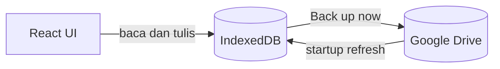
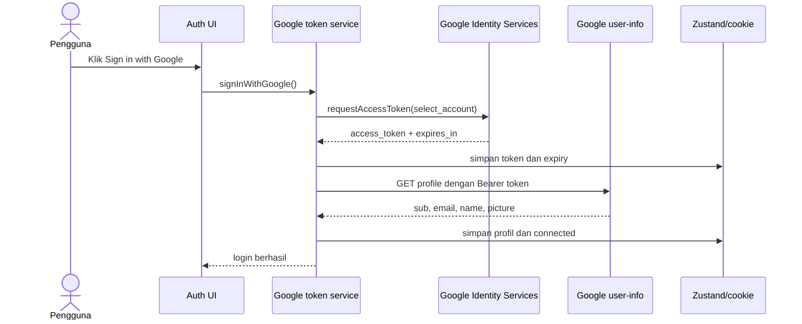
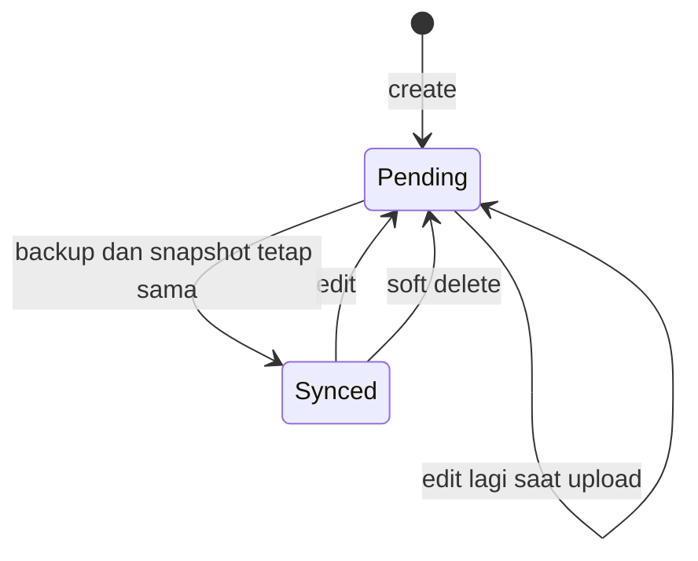

# Panduan Belajar Proyek Gratefully

Panduan ini membantu developer baru memahami implementasi Gratefully secara bertahap. Untuk referensi arsitektur yang lebih lengkap, baca juga [`STACK_DAN_ARSITEKTUR.md`](./STACK_DAN_ARSITEKTUR.md).

## 1. Tujuan belajar

Setelah mengikuti panduan ini, Anda diharapkan memahami:

- cara React, TanStack Router, Zustand, dan IndexedDB bekerja bersama;
- perbedaan sesi lokal Gratefully dan koneksi Google Drive;
- alur OAuth Google Identity Services;
- cara data lokal ditandai sebagai `pending`;
- perbedaan startup refresh dan backup manual;
- format file JSON di Google Drive `appDataFolder`;
- cara konflik, penghapusan, dan perpindahan bulan ditangani;
- batasan serta risiko arsitektur saat ini.

## 2. Model mental paling sederhana

Anggap Gratefully memiliki dua salinan data:

1. **Salinan kerja lokal** di IndexedDB — inilah yang dipakai layar aplikasi.
2. **Salinan cloud** berupa file JSON di Google Drive — dipakai untuk backup dan pertukaran perubahan antarperangkat.



Aturan terpenting:

- menulis jurnal tidak menunggu Google Drive;
- perubahan lokal langsung masuk IndexedDB sebagai `pending`;
- startup refresh hanya mengunduh;
- upload hanya terjadi melalui backup manual;
- token Drive yang kedaluwarsa tidak menghapus sesi lokal pengguna.

## 3. Stack yang perlu dipahami

| Urutan | Teknologi | Yang perlu dipahami |
| --- | --- | --- |
| 1 | TypeScript | Object type, union type, `async`/`await`, dan module import. |
| 2 | React 19 | Component, props, state, effect, dan custom hook. |
| 3 | TanStack Router | File-based route, root route, `beforeLoad`, redirect. |
| 4 | Zustand | Global store, selector, dan imperative `getState()`. |
| 5 | IndexedDB | Database, object store, index, request, transaction. |
| 6 | OAuth 2.0/GIS | Scope, access token, expiry, consent, dan account chooser. |
| 7 | Google Drive API | List, download, multipart create/update, `appDataFolder`. |
| 8 | Sinkronisasi data | Pending state, merge, tombstone, last-write-wins. |
| 9 | Vitest Browser/Playwright | Test yang berjalan dalam browser Chromium. |

UI memakai Tailwind CSS 4 dan komponen berbasis Radix/shadcn. i18next menangani terjemahan. TanStack Query tersedia di root aplikasi, tetapi penyimpanan jurnal utama tidak memakai query server; jurnal dibaca langsung dari repository IndexedDB.

Autentikasi aktif menggunakan Google Identity Services, bukan Clerk, walaupun package Clerk masih tercantum sebagai dependency dari fondasi proyek.

## 4. Tahap 1 — pahami bootstrap dan route

Baca:

1. `src/main.tsx`
2. `src/routes/__root.tsx`
3. `src/components/root-component.tsx`
4. `src/routes/auth.tsx`
5. `src/routes/grateful.tsx`
6. `src/routes/journey.tsx`
7. `src/routes/settings.tsx`

### Yang terjadi saat startup

1. `main.tsx` membuat `QueryClient` dan router.
2. Aplikasi dibungkus `QueryClientProvider` dan `DirectionProvider`.
3. Root route memasukkan script Google Identity Services.
4. `RootComponent` menjalankan `initializeAuth()`.
5. Setelah auth selesai, router di-invalidate agar route guard dievaluasi ulang.
6. Route selain `/auth` memerlukan status `authenticated`.

Route guard tidak mewajibkan Drive `connected`. Ini menjaga jurnal lokal tetap dapat digunakan ketika token Google telah kedaluwarsa.

### Latihan

- Cari semua route utama dan tulis feature container yang dirender.
- Ubah token menjadi kedaluwarsa melalui DevTools, refresh, lalu amati bahwa jurnal lokal tetap dapat diakses.
- Jelaskan mengapa redirect tidak dilakukan selama status masih `initializing`.

## 5. Tahap 2 — pahami autentikasi Google

Baca:

1. `src/stores/auth-store.ts`
2. `src/services/google-token.service.ts`
3. `src/features/auth/container/index.tsx`
4. `src/features/settings/container/components/data-sync-section.tsx`
5. `src/features/settings/container/components/sign-out-button.tsx`
6. `src/types/google.d.ts`
7. `src/services/google-token.service.test.ts`

### 5.1 State autentikasi

Auth store mempunyai dua kelompok status:

```ts
type AuthStatus = 'initializing' | 'authenticated' | 'unauthenticated'
type DriveConnectionStatus = 'connected' | 'disconnected' | 'connecting'
```

`AuthStatus` menjawab: **apakah pengguna mempunyai sesi lokal Gratefully?**

`DriveConnectionStatus` menjawab: **apakah aplikasi sekarang mempunyai kredensial yang dapat dipakai untuk Drive?**

Keduanya tidak boleh dianggap sama.

### 5.2 Data auth yang dipersist

Zustand menyimpan state di memory, sedangkan helper cookie mempersist:

| Cookie | Isi |
| --- | --- |
| `auth-user` | Profil lokal pengguna. |
| `thisisjustarandomstring` | OAuth access token. |
| `access-token-expires-at` | Waktu kedaluwarsa token dalam milidetik. |

Implementasi juga dapat memigrasikan nilai expiry lama dari `user.exp` yang berbentuk detik.

Karena cookie dibuat melalui JavaScript, cookie token tidak `HttpOnly`. Pahami ini sebagai risiko XSS, bukan sebagai pola keamanan ideal untuk semua produk.

### 5.3 Scope OAuth

```ts
const GOOGLE_SCOPE = [
  'openid',
  'email',
  'profile',
  'https://www.googleapis.com/auth/drive.appdata',
].join(' ')
```

Scope identitas digunakan untuk user-info. Scope `drive.appdata` hanya memberi akses ke data privat aplikasi, bukan seluruh My Drive.

### 5.4 Login pertama



Token client menyimpan satu `pendingTokenRequest`. Jadi, request bersamaan tidak membuka beberapa popup.

### 5.5 Validitas token

`isAccessTokenValid()` memerlukan:

- token tidak kosong;
- expiry tersedia;
- waktu sekarang masih lebih awal dari `expiresAt - 60 detik`.

`getValidAccessToken()` tidak pernah membuka popup. Jika token tidak tersedia, ia membatalkan kredensial Drive dan melempar `AuthRequiredError`.

Tidak ada refresh token dan tidak ada silent token refresh pada implementasi terbaru.

### 5.6 Reconnect

`reconnectGoogleDrive()` hanya dapat dipakai jika profil lokal tersedia. Fungsi membuka account chooser dan memastikan `profile.sub` sama dengan `user.accountNo`.

Tujuannya agar jurnal akun A tidak dikirim ke Drive akun B.

Jika popup dibatalkan atau akun salah dipilih:

- koneksi Drive kembali `disconnected`;
- sesi lokal tetap `authenticated`;
- jurnal lokal tetap tersedia.

### 5.7 Logout

Logout mencoba revoke token, kemudian membersihkan profil, token, dan expiry lokal. Kegagalan request revoke tidak menghalangi logout lokal.

### Latihan

- Gambarkan perbedaan kondisi “logout” dan “Drive disconnected”.
- Baca test reconnect akun yang salah dan jelaskan mengapa perbandingan memakai `sub`, bukan email.
- Jelaskan mengapa `VITE_GOOGLE_CLIENT_ID` boleh berada di frontend, tetapi client secret tidak boleh.

## 6. Tahap 3 — pahami IndexedDB

Baca:

1. `src/types/gratefully.ts`
2. `src/db/db.ts`
3. `src/db/request.ts`
4. `src/db/entries.repository.ts`
5. `src/db/metadata.repository.ts`

### 6.1 Schema database

```text
Nama    : gratefully-journal
Versi   : 2
Store   : entries, metadata
```

`entries` memakai `id` sebagai key dan mempunyai index `date` non-unik. `metadata` memakai `key` sebagai key.

`requestToPromise()` mengubah callback `IDBRequest` menjadi Promise agar repository dapat ditulis dengan `async`/`await`.

### 6.2 Bentuk entry

```ts
type GratefullyEntry = {
  id: string
  date: string
  content: string
  createdAt: string
  updatedAt: string
  deletedAt: string | null
  syncStatus: 'synced' | 'pending'
  pendingMonths?: string[]
  previousDate?: string | null
}
```

Bedakan field domain dan field lokal sinkronisasi:

- field yang dikirim ke Drive: `id`, `date`, `content`, `createdAt`, `updatedAt`, `deletedAt`;
- field lokal saja: `syncStatus`, `pendingMonths`, `previousDate`.

### 6.3 Lifecycle entry



Create/update/delete selalu memanggil `markLocalChange()`. Fungsi itu memperbarui `lastLocalChangeAt` dan mengirim event `gratefully:local-change`.

### 6.4 Soft delete

Delete tidak membuang record. Repository mengisi `deletedAt` dan mempertahankan record sebagai tombstone.

Alasannya: perangkat lain harus menerima bukti bahwa record telah dihapus. UI normal menyembunyikan tombstone dengan memeriksa `deletedAt === null`.

### 6.5 Pindah bulan

Jika tanggal diubah dari Agustus ke September:

- `pendingMonths` menyimpan Agustus dan September;
- `previousDate` menyimpan tanggal Agustus;
- backup membuat tombstone untuk bulan lama;
- entry aktif ditulis ke bulan baru.

### 6.6 Acknowledgment aman

`markEntriesSynced()` hanya mengubah entry menjadi `synced` jika `updatedAt` sekarang sama dengan snapshot yang mulai di-upload.

Jika pengguna mengedit entry saat request Drive masih berjalan, timestamp berubah. Entry tetap `pending` agar perubahan terbaru tidak dianggap sudah dibackup.

### Latihan

- Gunakan DevTools > Application > IndexedDB dan periksa kedua object store.
- Buat entry, edit, lalu hapus; amati perubahan `syncStatus`, `updatedAt`, dan `deletedAt`.
- Pindahkan entry ke bulan lain dan periksa `pendingMonths` serta `previousDate`.

## 7. Tahap 4 — pahami format Google Drive

Baca:

1. `src/sync/mapper.ts`
2. `src/utils/driveHelpers.ts`
3. `src/sync/mapper.test.ts`

Format aktif:

```text
metadata.json
gratitude_entries_YYYY-MM.json
```

### 7.1 Remote metadata

```json
{
  "version": 1,
  "updatedAt": "2026-09-18T10:00:00.000Z",
  "months": {
    "2026-09": { "updatedAt": "2026-09-18T10:00:00.000Z" }
  }
}
```

`remoteMonths` lokal menyimpan timestamp yang terakhir diamati. Dengan membandingkan timestamp ini, startup refresh hanya mengunduh bulan yang berubah.

### 7.2 File bulanan

```json
{
  "version": 1,
  "month": "2026-09",
  "updatedAt": "2026-09-18T10:00:00.000Z",
  "entries": []
}
```

Mapper bertugas:

- menghapus field lokal sebelum upload;
- menambahkan kembali default lokal setelah download;
- mengurutkan entry berdasarkan ID sebelum serialisasi;
- menolak struktur, tanggal, timestamp, bulan, atau ID duplikat yang tidak valid.

Validasi penting karena file remote merupakan input eksternal. Data rusak tidak boleh diperlakukan sebagai daftar kosong.

### Latihan

- Baca test mapper untuk kasus dokumen valid dan invalid.
- Tambahkan test contoh entry yang berada di bulan yang salah.
- Jelaskan mengapa `syncStatus` tidak boleh disimpan di Drive.

## 8. Tahap 5 — pahami Google Drive REST API

Baca:

1. `src/types/drive.ts`
2. `src/services/drive.service.ts`
3. `src/services/drive.service.test.ts`

Drive service memakai `fetch` langsung.

| Operasi | Method dan endpoint |
| --- | --- |
| Cari file | `GET https://www.googleapis.com/drive/v3/files?...&spaces=appDataFolder` |
| Unduh isi | `GET /drive/v3/files/{id}?alt=media` |
| Buat JSON | `POST https://www.googleapis.com/upload/drive/v3/files?uploadType=multipart` |
| Update JSON | `PATCH https://www.googleapis.com/upload/drive/v3/files/{id}?uploadType=multipart` |

Create menyertakan parent `appDataFolder`. Update tidak perlu mengubah parent.

### 8.1 Lapisan error

`DriveServiceError` mempunyai kode:

- `AUTHENTICATION`;
- `NOT_FOUND`;
- `NETWORK`;
- `INVALID_RESPONSE`;
- `API`.

Saat respons `401`, access token dibatalkan. Request tidak otomatis diulang dan tidak membuka popup Google. Reconnect harus dipicu pengguna.

### 8.2 Hal penting saat membaca `findFileByName()`

- query hanya mencari file yang belum di-trash;
- `spaces=appDataFolder` membatasi lokasi;
- pagination ditangani;
- respons Drive divalidasi;
- jika ada duplikat, file paling lama dipilih.

### Latihan

- Buka Network tab saat backup dan temukan request list, download, POST, atau PATCH.
- Periksa bahwa header memakai Bearer token tanpa menyalin token ke catatan/log.
- Jelaskan perbedaan metadata response Drive dan isi file dengan `alt=media`.

## 9. Tahap 6 — pahami merge dan sinkronisasi

Baca:

1. `src/sync/merge.ts`
2. `src/sync/sync.service.ts`
3. `src/hooks/use-sync.ts`
4. `src/features/settings/container/components/data-sync-section.tsx`

### 9.1 Merge

`mergeEntries(local, remote)` menggabungkan berdasarkan `id` dan memilih `updatedAt` yang lebih baru. Jika timestamp sama, lokal dipertahankan.

Ini adalah last-write-wins untuk keseluruhan entry. Tidak ada merge isi teks.

### 9.2 Startup refresh

Syarat:

- `authStatus === 'authenticated'`;
- `driveConnectionStatus === 'connected'`;
- `navigator.onLine`.

Langkah:

1. tunggu/catat satu `activeRefresh`;
2. migrasikan file legacy jika diperlukan;
3. baca `metadata.json`;
4. bandingkan timestamp remote dengan `remoteMonths` lokal;
5. unduh file bulan yang berubah;
6. validasi dan merge ke IndexedDB;
7. simpan timestamp remote terbaru;
8. kirim `gratefully:sync-complete` jika ada bulan berubah.

Refresh tidak meng-upload entry pending.

### 9.3 Backup manual

Langkah:

1. tolak operasi jika offline;
2. tunggu startup refresh yang masih aktif;
3. migrasikan format legacy jika perlu;
4. baca seluruh entry pending;
5. tentukan bulan yang terdampak;
6. baca file remote untuk setiap bulan;
7. gabungkan data lokal dan remote;
8. buat atau update file bulanan;
9. buat atau update `metadata.json`;
10. acknowledge snapshot pending;
11. simpan metadata lokal;
12. kirim `gratefully:sync-complete`.

Satu tab memakai `activeSync` agar backup tidak overlap. Mekanisme ini belum mengunci tab/perangkat lain.

### 9.4 Mengapa metadata ditulis terakhir?

`metadata.json` menjadi indeks bahwa versi file bulan tertentu sudah tersedia. Dengan menulis file bulan lebih dahulu, indeks tidak menunjuk ke update yang belum selesai dibuat.

Jika file bulan berhasil tetapi metadata gagal, entry belum di-acknowledge sebagai `synced`. Backup berikutnya dapat mencoba lagi.

### Latihan

- Buat dua versi entry dengan ID sama dan timestamp berbeda, lalu uji `mergeEntries()`.
- Simulasikan edit ketika upload berjalan dan pastikan entry tetap pending.
- Jelaskan risiko dua perangkat menekan backup pada waktu yang hampir sama.

## 10. Tahap 7 — pahami migrasi legacy

Format lama adalah satu file `gratitude_db.json`. Migrasi hanya berjalan jika `metadata.json` belum ada.

Urutan migrasi:

1. baca dan validasi file lama;
2. kelompokkan entry berdasarkan bulan;
3. merge dengan file bulanan yang sudah ada;
4. tulis file-file bulan;
5. tulis `metadata.json` paling akhir;
6. pertahankan file legacy sebagai backup.

Proses didesain agar relatif aman diulang setelah kegagalan parsial.

Jangan keliru dengan helper kompatibilitas `journal_db.json` di `drive.service.ts`; helper itu bukan protokol gratitude bulanan yang aktif.

## 11. Event dan state UI

| Event | Arti |
| --- | --- |
| `gratefully:local-change` | IndexedDB berubah karena aksi lokal. |
| `gratefully:sync-complete` | Refresh atau backup berhasil menyelesaikan perubahan data. |

`useSync()` mendengarkan event tersebut untuk memuat ulang:

- jumlah pending;
- waktu backup terakhir.

Feature jurnal/journey juga dapat memuat ulang daftar setelah sync complete. IndexedDB tetap menjadi sumber tampilan UI.

Status hook:

```ts
type SyncStatus = 'idle' | 'syncing' | 'synced' | 'offline' | 'error'
```

Error autentikasi Drive dikembalikan ke kondisi idle/disconnected agar UI menawarkan reconnect, sedangkan error cloud lainnya ditampilkan sebagai error.

## 12. Keterbatasan yang wajib diketahui

1. **Token berada dalam cookie JavaScript**, bukan cookie `HttpOnly`.
2. **Tidak ada refresh token**; pengguna harus reconnect setelah token tidak valid.
3. **Last-write-wins bergantung pada jam perangkat**.
4. **Tidak ada ETag/`If-Match`**, sehingga race antarperangkat masih mungkin.
5. **Lock hanya satu tab**, bukan cross-tab/cross-device.
6. **Tombstone belum dibersihkan** dengan retention policy.
7. **Data Drive belum dienkripsi client-side**.
8. **IndexedDB belum terlihat dipartisi per akun** dalam bentuk entry; pergantian akun pada browser yang sama perlu dipikirkan dengan hati-hati.
9. **Backup manual berarti data pending belum aman di cloud** sampai pengguna menekan tombol dan proses berhasil.
10. **Menghapus site data/browser sebelum backup dapat menghilangkan jurnal lokal**.

## 13. Jalur belajar yang disarankan

### Level pemula

1. Jalankan aplikasi dan kenali route.
2. Buat/edit/hapus jurnal sambil melihat IndexedDB.
3. Pelajari tipe `GratefullyEntry`.
4. Ikuti alur dari component ke repository.

### Level menengah

1. Ikuti alur login dari tombol sampai cookie.
2. Ikuti `useSync()` ke `sync.service.ts`.
3. Pelajari mapper dan format file Drive.
4. Jalankan test auth, Drive, dan mapper.

### Level lanjutan

1. Analisis race condition antarperangkat.
2. Rancang ETag/optimistic concurrency.
3. Rancang partisi data lokal per akun.
4. Rancang enkripsi client-side dan manajemen kunci.
5. Rancang retention tombstone yang tetap aman untuk perangkat lama.

## 14. Checklist ketika mengubah kode

### Jika mengubah IndexedDB

- naikkan versi database jika schema berubah;
- tambahkan migration di `onupgradeneeded`;
- pertahankan data pengguna lama;
- uji database baru dan database hasil upgrade.

### Jika mengubah bentuk entry

- update tipe lokal;
- update repository normalization;
- update mapper upload/download;
- update validasi remote;
- pikirkan kompatibilitas file lama;
- tambah test.

### Jika mengubah OAuth

- gunakan scope seminimal mungkin;
- jangan masukkan client secret ke frontend;
- jangan buka popup dari background effect;
- pertahankan pemisahan sesi lokal dan koneksi Drive;
- uji login, cancel, expiry, 401, reconnect, akun salah, dan logout.

### Jika mengubah sync

- jangan menganggap JSON rusak sebagai data kosong;
- jangan acknowledge entry sebelum metadata remote berhasil;
- pertahankan pengecekan snapshot `updatedAt`;
- uji create, update, delete, pindah bulan, offline, dan kegagalan parsial;
- pertimbangkan race cross-tab dan cross-device.

## 15. Perintah validasi

```bash
pnpm test
pnpm build
pnpm lint
pnpm format:check
```

Untuk perubahan kecil, mulai dari test yang paling dekat dengan modul yang diubah, kemudian jalankan validasi yang lebih luas.

## 16. Pertanyaan evaluasi mandiri

Jika dapat menjawab pertanyaan berikut, Anda sudah memahami inti arsitektur:

1. Mengapa UI membaca IndexedDB, bukan Drive secara langsung?
2. Mengapa pengguna tetap login saat token Drive kedaluwarsa?
3. Mengapa `getValidAccessToken()` tidak membuka popup?
4. Mengapa delete harus menjadi tombstone?
5. Mengapa pemindahan tanggal antarbulan perlu menulis dua file bulan?
6. Mengapa startup refresh tidak meng-upload data pending?
7. Mengapa file bulanan ditulis sebelum `metadata.json`?
8. Bagaimana edit saat upload berlangsung tetap ditandai pending?
9. Apa kelemahan last-write-wins berbasis waktu perangkat?
10. Mengapa `drive.appdata` lebih aman daripada scope Drive penuh untuk kebutuhan ini?

## 17. Ringkasan file inti

| Urutan baca | File | Fokus |
| --- | --- | --- |
| 1 | `src/types/gratefully.ts` | Model data. |
| 2 | `src/db/db.ts` | Schema IndexedDB. |
| 3 | `src/db/entries.repository.ts` | CRUD, pending, tombstone. |
| 4 | `src/db/metadata.repository.ts` | Metadata dan local-change event. |
| 5 | `src/stores/auth-store.ts` | Sesi, cookie, status Drive. |
| 6 | `src/services/google-token.service.ts` | GIS, token, login, reconnect, logout. |
| 7 | `src/services/drive.service.ts` | Request Google Drive API. |
| 8 | `src/sync/mapper.ts` | Kontrak dan validasi JSON remote. |
| 9 | `src/sync/merge.ts` | Resolusi konflik. |
| 10 | `src/sync/sync.service.ts` | Refresh, backup, migrasi. |
| 11 | `src/hooks/use-sync.ts` | Integrasi lifecycle React. |
| 12 | `src/features/settings/container/components/data-sync-section.tsx` | Pengalaman pengguna sync/reconnect. |
