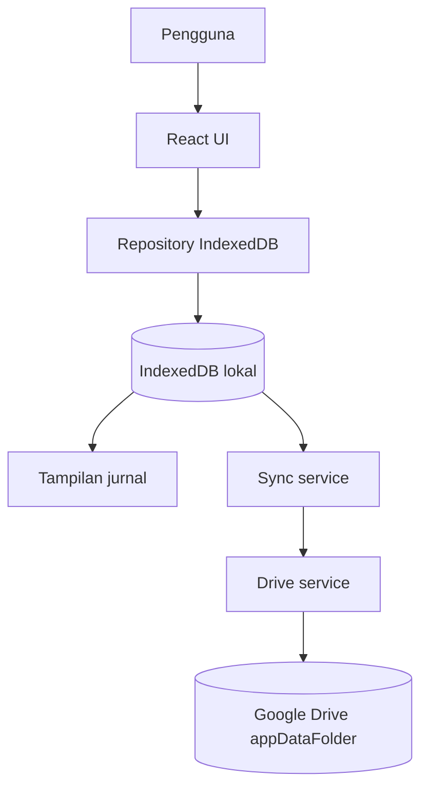
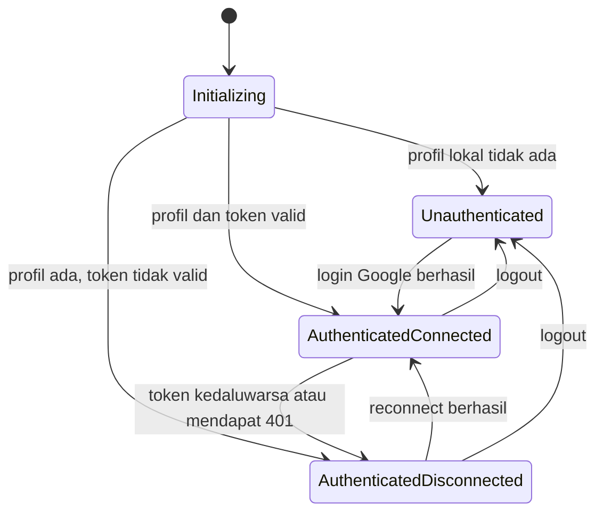
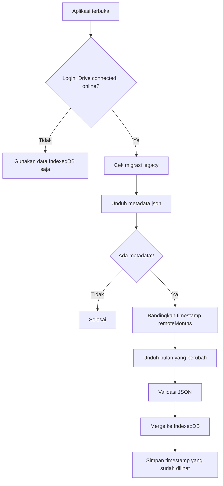
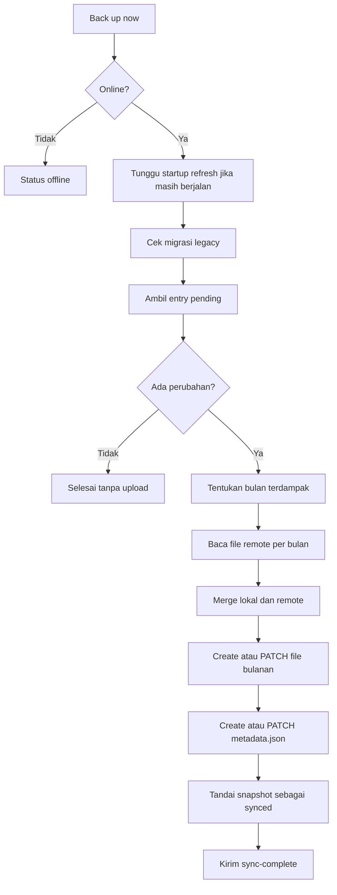

# Stack dan Arsitektur Gratefully

Dokumen ini menjelaskan teknologi dan arsitektur proyek Gratefully dengan bahasa sederhana. Penjelasan difokuskan pada bagian yang paling penting: Google Authentication, IndexedDB, sinkronisasi Google Drive, dan pemakaian Google Drive API.

> **Ringkasan satu kalimat:** Gratefully adalah jurnal rasa syukur berbasis web yang menyimpan data terlebih dahulu di browser, lalu mencadangkannya ke ruang privat Google Drive saat pengguna meminta backup.

## 1. Gambaran besar

Gratefully memakai pendekatan **local-first**.

Artinya:

1. Pengguna menulis jurnal.
2. Jurnal langsung disimpan ke IndexedDB di perangkat tersebut.
3. UI membaca jurnal dari IndexedDB, bukan langsung dari Google Drive.
4. Jurnal tetap dapat dibuat dan dibaca ketika internet terputus.
5. Jika pengguna menekan **Back up now**, perubahan lokal dikirim ke Google Drive.
6. Saat aplikasi dibuka dan koneksi Drive masih aktif, aplikasi mengambil perubahan terbaru dari Drive ke IndexedDB.

Google Drive dalam proyek ini bukan database utama yang harus selalu tersedia. Google Drive adalah tempat backup dan perantara sinkronisasi antarperangkat.



Konsekuensi desain ini:

- respons menulis jurnal terasa cepat karena tidak menunggu jaringan;
- aplikasi tetap berguna saat offline;
- data yang belum dibackup hanya ada pada browser/perangkat saat ini;
- menghapus data situs/browser sebelum backup dapat menghilangkan data lokal;
- sinkronisasi membutuhkan access token Google yang masih berlaku.

## 2. Stack teknologi

### 2.1 Stack utama yang benar-benar membentuk aplikasi

| Area | Teknologi | Fungsi di proyek |
| --- | --- | --- |
| Bahasa | TypeScript | Memberi tipe data agar kesalahan lebih mudah ditemukan saat development/build. |
| UI | React 19 | Membuat layar dan komponen interaktif. |
| Build tool | Vite 8 | Development server, bundling, dan production build. |
| Styling | Tailwind CSS 4 | Menulis styling berbasis utility class. |
| Komponen UI | shadcn-style components + Radix UI | Primitive UI yang accessible seperti dialog, dropdown, tabs, dan tooltip. |
| Routing | TanStack Router | File-based routing dan route yang type-safe. |
| State global | Zustand | Menyimpan status autentikasi dan koneksi Google Drive. |
| Async tooling | TanStack Query | Menyediakan Query Client pada level aplikasi; jurnal inti saat ini tetap dibaca melalui repository IndexedDB. |
| Penyimpanan lokal | Native IndexedDB API | Menyimpan jurnal dan metadata sinkronisasi di browser. Tidak memakai library wrapper IndexedDB. |
| Login/OAuth | Google Identity Services | Membuka account chooser dan menghasilkan OAuth access token. |
| Cloud storage | Google Drive REST API v3 | Membaca dan menulis file JSON privat di `appDataFolder`. |
| Lokalisasi | i18next + react-i18next | Terjemahan UI bahasa Inggris dan Indonesia. |
| Form/validasi | React Hook Form + Zod | Infrastruktur form dan validasi pada fitur yang memerlukannya. |
| Test | Vitest Browser Mode + Playwright Chromium | Menjalankan test di lingkungan browser nyata/headless. |
| Lint/format | ESLint + Prettier | Menjaga kualitas dan format kode. |

Beberapa dependency berasal dari fondasi dashboard awal, misalnya Clerk, Axios, React Table, dan Recharts. Keberadaan dependency tidak selalu berarti dependency itu menjadi bagian dari alur jurnal utama. Autentikasi jurnal yang aktif saat ini menggunakan **Google Identity Services**, bukan Clerk.

### 2.2 Konfigurasi build dan test

`vite.config.ts` memasang plugin berikut:

- `@tanstack/router-plugin` untuk menghasilkan route tree dan code splitting;
- `@vitejs/plugin-react` untuk React;
- `@tailwindcss/vite` untuk Tailwind CSS;
- alias `@` yang menunjuk ke folder `src`;
- Vitest Browser Mode dengan Playwright Chromium.

Perintah penting:

```bash
pnpm dev
pnpm build
pnpm lint
pnpm test
pnpm format:check
```

## 3. Struktur source code

```text
src/
├── routes/       # Definisi URL dengan TanStack Router
├── components/   # Komponen umum, shell aplikasi, dan primitive UI
├── features/     # UI dan logic per fitur
├── hooks/        # Hook lintas fitur, termasuk useSync
├── db/           # Setup IndexedDB dan repository
├── sync/         # Format file, validasi, merge, migrasi, dan orkestrasi sync
├── services/     # Google token, Google Drive HTTP, dan service lainnya
├── stores/       # Zustand auth store
├── types/        # Tipe domain dan kontrak API
├── i18n/         # Konfigurasi serta kamus bahasa
├── utils/        # Helper umum
└── styles/       # CSS dan design tokens
```

Pemisahan tanggung jawabnya:

- **UI/feature** menangani interaksi pengguna;
- **repository** menjadi pintu akses ke IndexedDB;
- **sync service** menentukan urutan proses sinkronisasi;
- **Drive service** hanya menangani request HTTP ke Google Drive;
- **Google token service** hanya menangani sesi lokal, token, dan koneksi Google;
- **mapper** memvalidasi serta mengubah format data lokal/remote.

UI tidak seharusnya memanggil Google Drive API secara langsung.

## 4. Komposisi aplikasi dan routing

`src/main.tsx` membuat:

1. `QueryClient`;
2. TanStack Router;
3. `QueryClientProvider`;
4. `DirectionProvider` untuk arah layout;
5. `RouterProvider`.

`src/routes/__root.tsx` adalah root route sekaligus route guard. Route selain `/auth` hanya dapat dibuka jika status sesi lokal sudah `authenticated`.

Hal yang sangat penting: route guard memeriksa **sesi pengguna lokal**, bukan wajib memeriksa access token Drive. Karena itu, saat token Google sudah kedaluwarsa, pengguna masih dapat membuka jurnal lokalnya.

Route utama:

| Route | Fungsi |
| --- | --- |
| `/auth` | Login dengan akun Google. |
| `/` | Dashboard/ringkasan jurnal. |
| `/grateful` | Membuat dan melihat jurnal rasa syukur. |
| `/journey` | Menelusuri, mengubah, dan menghapus jurnal. |
| `/settings` | Pengaturan akun, bahasa, koneksi Drive, dan backup. |

`src/components/root-component.tsx` memanggil `initializeAuth()` saat startup, lalu meminta router mengevaluasi ulang route setelah status autentikasi selesai ditentukan.

## 5. Google Authentication dan OAuth

### 5.1 Dua hal yang harus dibedakan

Dalam implementasi ini ada dua kondisi yang berhubungan tetapi berbeda:

1. **Sesi lokal Gratefully** — ditandai oleh adanya profil `auth.user`.
2. **Koneksi Google Drive** — membutuhkan OAuth access token yang belum kedaluwarsa.

Pengguna bisa tetap login di Gratefully tetapi Drive sedang terputus. Kondisi ini memang disengaja agar kedaluwarsanya token tidak mengunci pengguna dari jurnal yang tersimpan lokal.



### 5.2 Google Identity Services dimuat di browser

Script GIS dimasukkan melalui root route:

```text
https://accounts.google.com/gsi/client
```

`google-token.service.ts` juga dapat membuat script tersebut jika belum ditemukan. Service menunggu maksimal 10 detik sampai `window.google.accounts.oauth2` tersedia.

Aplikasi memakai **OAuth 2.0 token client**, bukan menyimpan password Google dan bukan memakai client secret.

Konfigurasi frontend yang diperlukan:

```env
VITE_GOOGLE_CLIENT_ID=...
```

`VITE_GOOGLE_CLIENT_ID` bukan secret. Client ID memang dikirim ke browser. Sebaliknya, **Google client secret tidak boleh diletakkan di frontend**.

### 5.3 Scope yang diminta

```text
openid
email
profile
https://www.googleapis.com/auth/drive.appdata
```

Fungsinya:

- `openid`, `email`, dan `profile`: membaca identitas dasar pengguna;
- `drive.appdata`: membaca/menulis ruang data aplikasi yang privat.

Aplikasi tidak meminta scope penuh seperti `drive`, sehingga tidak mendapat akses bebas ke semua file di My Drive.

### 5.4 Alur login pertama kali

Ketika tombol login ditekan:

1. `AuthContainer` memanggil `signInWithGoogle()`.
2. Service memanggil `requestAccessToken('select_account')`.
3. GIS membuka account chooser.
4. Google mengembalikan access token dan `expires_in`.
5. Token dan waktu kedaluwarsa disimpan ke auth store.
6. Token dipakai untuk memanggil:
   `https://www.googleapis.com/oauth2/v3/userinfo`.
7. Profil seperti `sub`, email, nama, dan foto disimpan sebagai `auth.user`.
8. Status sesi menjadi `authenticated`, koneksi Drive menjadi `connected`.
9. Pengguna diarahkan ke `/grateful`.

`sub` disimpan sebagai `accountNo` dan menjadi identitas stabil akun Google.

### 5.5 Penyimpanan auth di cookie

`src/stores/auth-store.ts` memakai Zustand untuk state runtime dan helper cookie untuk persistensi:

- cookie `auth-user`: profil pengguna;
- cookie `thisisjustarandomstring`: access token;
- cookie `access-token-expires-at`: waktu kedaluwarsa token dalam milidetik.

Nama cookie token terlihat tidak deskriptif, tetapi itulah nama yang dipakai implementasi saat ini.

Access token dianggap tidak valid jika waktunya tersisa kurang dari 60 detik. Margin ini mengurangi risiko token habis ketika request sedang berjalan.

### 5.6 Startup setelah halaman dibuka kembali

`initializeAuth()` tidak membuka popup Google.

- Jika profil lokal tidak ada, seluruh auth state di-reset dan pengguna dianggap belum login.
- Jika profil ada dan token masih valid, sesi tetap login serta Drive `connected`.
- Jika profil ada tetapi token hilang/kedaluwarsa, sesi tetap login tetapi Drive `disconnected`.

Tidak ada refresh token di frontend ini. Tidak ada proses silent GIS untuk mendapatkan token baru. Reconnect harus berasal dari tindakan pengguna.

### 5.7 Reconnect Google Drive

Di Settings, tombol **Reconnect** memanggil `reconnectGoogleDrive()`:

1. memastikan profil lokal masih ada;
2. membuka account chooser dengan `select_account`;
3. mengambil profil dari user-info endpoint;
4. membandingkan `profile.sub` dengan `accountNo` sesi lokal;
5. hanya menerima akun Google yang sama;
6. mengubah koneksi menjadi `connected`;
7. UI langsung mencoba menjalankan backup.

Pemeriksaan akun mencegah jurnal sesi akun A tanpa sengaja dibackup ke Drive akun B.

### 5.8 Token concurrent, error 401, dan logout

Jika dua bagian aplikasi meminta token secara bersamaan, `pendingTokenRequest` membuat keduanya memakai satu Promise dan satu popup yang sama.

`getValidAccessToken()` hanya mengembalikan token yang sudah tersedia dan valid. Fungsi ini **tidak membuka GIS UI**. Jika token tidak tersedia, fungsi melempar `AuthRequiredError`.

Jika Drive API mengembalikan HTTP `401`, `drive.service.ts` memanggil `invalidateAccessToken()`. Hasilnya:

- access token dan expiry dihapus;
- sesi/profil lokal tetap ada;
- status Drive menjadi `disconnected`;
- pengguna harus reconnect dari UI.

Saat logout:

- token dicoba untuk di-revoke melalui GIS;
- jika GIS tidak tersedia, aplikasi mencoba endpoint revoke Google;
- cookie profil, token, dan expiry dihapus;
- status lokal menjadi `unauthenticated`.

> **Catatan keamanan:** cookie dibuat oleh JavaScript sehingga tidak `HttpOnly`. Jika terjadi XSS, token dapat dibaca oleh script jahat. Terapkan Content Security Policy yang ketat, hindari rendering HTML mentah, audit dependency, dan jangan pernah menyimpan client secret di frontend.

## 6. Penyimpanan lokal dengan IndexedDB

### 6.1 Mengapa IndexedDB?

IndexedDB cocok untuk data jurnal karena:

- kapasitasnya lebih besar daripada `localStorage`;
- mendukung object store dan index;
- operasinya asynchronous sehingga lebih ramah untuk UI;
- data tersimpan antar-refresh;
- dapat digunakan saat offline.

Proyek menggunakan native IndexedDB API, tanpa Dexie atau `idb`.

### 6.2 Database dan object store

`src/db/db.ts` membuka:

```text
Database name    : gratefully-journal
Database version : 2
```

Object store:

| Store | Key path | Isi |
| --- | --- | --- |
| `entries` | `id` | Semua jurnal aktif, tombstone penghapusan, dan status pending. |
| `metadata` | `key` | Metadata sinkronisasi lokal. |

Store `entries` memiliki index non-unik `date`, sehingga beberapa jurnal dapat mempunyai tanggal yang sama.

`openDatabase()` menyimpan satu `databasePromise` agar pemanggil memakai koneksi yang sama. Saat `versionchange`, koneksi ditutup dan cache Promise dikosongkan supaya upgrade berikutnya dapat berjalan.

### 6.3 Bentuk data jurnal lokal

```ts
type GratefullyEntry = {
  id: string
  date: string
  content: string
  createdAt: string
  updatedAt: string
  deletedAt: string | null
  syncStatus: 'synced' | 'pending'
  pendingMonths?: string[]
  previousDate?: string | null
}
```

Arti field:

| Field | Arti |
| --- | --- |
| `id` | UUID stabil untuk mengenali jurnal yang sama di semua perangkat. |
| `date` | Tanggal jurnal dengan format `YYYY-MM-DD`. |
| `content` | Isi jurnal. |
| `createdAt` | Waktu jurnal dibuat. |
| `updatedAt` | Waktu perubahan terakhir dan dasar penyelesaian konflik. |
| `deletedAt` | Waktu dihapus; `null` berarti masih aktif. |
| `syncStatus` | `pending` jika perubahan belum diakui oleh backup berhasil. |
| `pendingMonths` | Daftar bulan remote yang perlu ditulis. |
| `previousDate` | Tanggal lama jika jurnal dipindah ke bulan lain. |

Tiga field terakhir yang berhubungan dengan proses lokal (`syncStatus`, `pendingMonths`, `previousDate`) tidak dikirim ke Google Drive.

### 6.4 Create, read, update, dan delete

Semua operasi ada di `src/db/entries.repository.ts`.

**Create**:

- memvalidasi tanggal;
- membuat UUID dengan `crypto.randomUUID()`;
- membuat `createdAt` dan `updatedAt`;
- menetapkan `syncStatus: 'pending'`;
- memasukkan bulan jurnal ke `pendingMonths`.

**Read**:

- `getAllEntries()` mengambil seluruh record, termasuk tombstone;
- `getActiveEntries()` menyaring jurnal yang belum dihapus;
- `getEntriesByDate()` memakai index `date` lalu membuang tombstone;
- `getPendingEntries()` mencari perubahan yang belum dibackup.

**Update**:

- mempertahankan `id` dan `createdAt`;
- memperbarui `updatedAt`;
- mengubah status menjadi `pending`;
- jika berpindah bulan, menyimpan bulan lama dan bulan baru.

**Delete** memakai soft delete:

- record tidak langsung dihapus dari IndexedDB;
- `deletedAt` dan `updatedAt` diisi timestamp yang sama;
- record menjadi `pending`.

Soft delete diperlukan agar perangkat lain juga tahu bahwa jurnal harus dihapus. Jika record langsung hilang secara fisik, tidak ada informasi yang dapat dikirim ke Drive.

### 6.5 Mengapa pemindahan bulan lebih rumit?

Misalnya jurnal awalnya bertanggal `2026-08-31`, kemudian diubah menjadi `2026-09-01`.

Data remote dibagi per bulan. Maka proses backup harus:

1. menulis jurnal aktif ke file September;
2. menulis tombstone buatan ke file Agustus;
3. setelah backup lengkap berhasil, membersihkan `pendingMonths` dan `previousDate`.

Tanpa tombstone di bulan lama, jurnal lama dapat muncul kembali saat perangkat lain mengunduh file Agustus.

### 6.6 Metadata sinkronisasi lokal

Store `metadata` menyimpan satu record:

```ts
type SyncMetadata = {
  key: 'sync'
  schemaVersion: number
  lastSyncedAt: string | null
  lastLocalChangeAt: string | null
  remoteMonths: Record<string, string>
}
```

- `lastSyncedAt`: backup manual terakhir yang selesai;
- `lastLocalChangeAt`: perubahan lokal terakhir;
- `remoteMonths`: timestamp tiap bulan remote yang terakhir dilihat;
- `schemaVersion`: versi bentuk metadata lokal.

Setiap create/update/delete memanggil `markLocalChange()`, lalu browser mengirim event `gratefully:local-change`. Event ini memperbarui pending count di UI, **bukan langsung meng-upload data**.

## 7. Penyimpanan Google Drive

### 7.1 Mengapa `appDataFolder`?

File disimpan di ruang khusus aplikasi bernama `appDataFolder`.

Sifatnya:

- terikat pada akun Google pengguna;
- tidak tampil sebagai file biasa di My Drive;
- hanya dapat diakses aplikasi melalui scope `drive.appdata`;
- cocok untuk backup internal aplikasi.

Pengguna tidak mengedit file tersebut secara normal dari Google Drive UI.

### 7.2 Format file aktif

Data dibagi berdasarkan bulan:

```text
metadata.json
gratitude_entries_2026-08.json
gratitude_entries_2026-09.json
...
```

`metadata.json` menjadi indeks remote:

```json
{
  "version": 1,
  "updatedAt": "2026-09-18T10:00:00.000Z",
  "months": {
    "2026-08": { "updatedAt": "2026-09-01T09:00:00.000Z" },
    "2026-09": { "updatedAt": "2026-09-18T10:00:00.000Z" }
  }
}
```

Contoh file bulanan:

```json
{
  "version": 1,
  "month": "2026-09",
  "updatedAt": "2026-09-18T10:00:00.000Z",
  "entries": [
    {
      "id": "contoh-uuid",
      "date": "2026-09-18",
      "content": "Bersyukur bisa belajar hari ini.",
      "createdAt": "2026-09-18T09:00:00.000Z",
      "updatedAt": "2026-09-18T10:00:00.000Z",
      "deletedAt": null
    }
  ]
}
```

Pembagian per bulan membuat perubahan kecil tidak perlu membaca dan menulis seluruh riwayat jurnal.

### 7.3 Validasi data remote

Data dari Drive tidak langsung dipercaya. `src/sync/mapper.ts` memeriksa:

- dokumen harus berupa object;
- versi harus sesuai;
- timestamp harus ISO date string;
- tanggal jurnal harus valid;
- jurnal harus berada dalam bulan file yang benar;
- ID tidak boleh duplikat dalam satu file;
- field wajib harus memiliki tipe yang benar.

Download dan parsing dilakukan sebelum IndexedDB dimutasi. JSON remote yang rusak akan menghasilkan error, bukan dianggap sebagai database kosong yang menghapus data lokal.

## 8. Google Drive API yang digunakan

Semua request Drive dipusatkan di `src/services/drive.service.ts`. Implementasi memakai native `fetch`, bukan Google API SDK.

Base URL:

```text
Metadata API : https://www.googleapis.com/drive/v3
Upload API   : https://www.googleapis.com/upload/drive/v3
```

Semua request diberi header:

```http
Authorization: Bearer ACCESS_TOKEN
```

### 8.1 Mencari file di appDataFolder

Konsep request:

```http
GET /drive/v3/files
  ?q=name = 'metadata.json' and trashed = false
  &spaces=appDataFolder
  &fields=nextPageToken,files(id,name,mimeType,createdTime,modifiedTime)
  &pageSize=100
```

Service:

- menangani pagination dengan `nextPageToken`;
- menyaring ulang berdasarkan nama;
- jika ada file duplikat, mengurutkannya dari `createdTime` paling lama dan memakai file pertama.

### 8.2 Mengunduh JSON

```http
GET /drive/v3/files/{fileId}?alt=media
```

`alt=media` meminta isi file, bukan metadata resource Drive.

### 8.3 Membuat file JSON

```http
POST /upload/drive/v3/files?uploadType=multipart&fields=...
Content-Type: multipart/related; boundary=...
```

Body multipart berisi:

1. metadata file: nama, MIME type `application/json`, parent `appDataFolder`;
2. isi JSON aplikasi.

Parent hanya diberikan saat membuat file baru.

### 8.4 Memperbarui file JSON

```http
PATCH /upload/drive/v3/files/{fileId}?uploadType=multipart&fields=...
Content-Type: multipart/related; boundary=...
```

Saat update, service tidak mengubah parent file; service hanya mengganti metadata nama/MIME dan kontennya.

### 8.5 Penanganan error

`DriveServiceError` menyederhanakan error menjadi:

| Kode | Penyebab umum |
| --- | --- |
| `AUTHENTICATION` | Token tidak ada/tidak valid atau HTTP 401. |
| `NOT_FOUND` | HTTP 404. |
| `NETWORK` | `fetch` gagal menjangkau Google. |
| `INVALID_RESPONSE` | Respons Google atau JSON tidak sesuai bentuk yang diharapkan. |
| `API` | Error API lainnya, termasuk status non-OK selain 401/404. |

HTTP `401` membatalkan token lokal. Implementasi saat ini tidak otomatis meminta token baru dan tidak otomatis retry request.

## 9. Proses sinkronisasi

Ada dua proses terpisah. Memisahkannya membantu mencegah background process tanpa sengaja meng-upload perubahan lokal.

### 9.1 Refresh saat startup: Drive ke IndexedDB

`useSync()` menjalankan `refreshFromGoogleDrive()` jika:

- sesi lokal `authenticated`;
- Drive `connected`;
- browser online.



Ciri penting:

- bersifat **download-only**;
- tidak meng-upload record `pending`;
- IndexedDB dapat sudah tampil sebelum refresh selesai;
- hanya bulan yang timestamp-nya berubah yang diunduh;
- jika akun Drive baru dan `metadata.json` belum ada, refresh berhenti normal;
- jika token sudah tidak valid, refresh berhenti dan pengguna perlu reconnect.

### 9.2 Backup manual: IndexedDB ke Drive

Tombol **Back up now** memanggil `syncNow()`.



Detail penting:

- satu tab hanya menjalankan satu `activeSync`; pemanggil bersamaan berbagi Promise;
- jika refresh startup sedang berjalan, backup menunggunya selesai;
- hanya bulan terdampak yang ditulis;
- file bulanan ditulis lebih dahulu, kemudian `metadata.json`;
- entry baru ditandai `synced` setelah seluruh metadata remote berhasil ditulis;
- acknowledgment memeriksa `updatedAt` snapshot;
- jika entry diedit lagi ketika upload berlangsung, `updatedAt` sudah berbeda sehingga entry tetap `pending` untuk backup berikutnya.

### 9.3 Aturan merge dan konflik

`src/sync/merge.ts` melakukan merge berdasarkan `id`.

Aturannya:

1. jika ID hanya ada di satu sisi, record tersebut dipakai;
2. jika ID ada di lokal dan remote, nilai dengan `updatedAt` lebih baru menang;
3. jika timestamp sama, data lokal menang karena lokal diproses lebih dahulu;
4. tombstone ikut aturan yang sama.

Ini disebut **last-write-wins pada level satu entry**. Sistem tidak mencoba menggabungkan teks per kata atau per karakter.

Keterbatasannya:

- jam perangkat yang salah dapat membuat perubahan yang sebenarnya lama terlihat lebih baru;
- tidak memakai ETag atau `If-Match`, sehingga dua perangkat dapat saling menimpa saat upload bersamaan;
- penguncian `activeSync` hanya bekerja dalam satu instance/tab;
- tombstone belum memiliki mekanisme pembersihan/retensi;
- isi backup belum dienkripsi di sisi klien sebelum dikirim ke Drive.

## 10. Migrasi format Drive lama

Format lama memakai satu file:

```text
gratitude_db.json
```

`migrateLegacyIfNeeded()` berjalan sebelum refresh/backup:

1. jika `metadata.json` sudah ada, migrasi dilewati;
2. cari `gratitude_db.json`;
3. validasi format lama;
4. kelompokkan entry berdasarkan bulan;
5. merge dengan file bulanan yang mungkin sudah ada;
6. tulis semua file bulanan;
7. terakhir, buat `metadata.json`.

File lama tidak dihapus. Urutan ini membuat migrasi lebih aman untuk dicoba ulang jika proses berhenti di tengah.

`drive.service.ts` juga masih memiliki helper kompatibilitas untuk format `journal_db.json`, tetapi komentar kode menyatakan helper tersebut milik service lama dan bukan jalur sinkronisasi gratitude bulanan yang aktif.

## 11. Event internal dan pembaruan UI

Aplikasi memakai browser event sederhana:

| Event | Dibuat oleh | Tujuan |
| --- | --- | --- |
| `gratefully:local-change` | `markLocalChange()` | Meminta UI memuat ulang pending count dan metadata lokal. |
| `gratefully:sync-complete` | refresh/backup berhasil | Meminta hook dan layar memuat ulang data dari IndexedDB. |

`useSync()` mengembalikan:

```ts
{
  status,        // idle | syncing | synced | offline | error
  lastSyncedAt,
  pendingCount,
  error,
  sync
}
```

Status ini dipakai Settings untuk menampilkan jumlah pending, waktu backup terakhir, error, tombol reconnect, dan tombol backup.

## 12. Skenario end-to-end

### Skenario A: menulis ketika offline

1. Pengguna membuka jurnal yang sebelumnya sudah tersimpan.
2. Pengguna menulis entry baru.
3. Entry masuk ke IndexedDB dengan status `pending`.
4. UI langsung menampilkan entry.
5. Backup tidak dapat berjalan ketika offline.
6. Setelah online dan token valid, pengguna menekan **Back up now**.
7. Entry masuk ke file bulan yang sesuai dan berubah menjadi `synced`.

### Skenario B: token kedaluwarsa

1. Profil lokal masih ada.
2. `initializeAuth()` menemukan token tidak valid.
3. Access token dibuang, tetapi profil lokal dipertahankan.
4. Pengguna tetap dapat membaca/menulis jurnal lokal.
5. Settings menampilkan Drive `Disconnected`.
6. Pengguna menekan **Reconnect** dan memilih akun yang sama.
7. Backup dijalankan setelah koneksi berhasil.

### Skenario C: perubahan dari perangkat lain

1. Perangkat A mengubah entry dan melakukan backup.
2. Timestamp bulan di `metadata.json` berubah.
3. Perangkat B membuka aplikasi dengan koneksi Drive valid.
4. Startup refresh melihat timestamp bulan berbeda.
5. Perangkat B mengunduh file bulan tersebut.
6. Entry lokal dan remote digabung berdasarkan `id` dan `updatedAt`.
7. UI diberi event `sync-complete` lalu membaca IndexedDB terbaru.

## 13. Konfigurasi Google Cloud

Checklist minimum:

1. Buat/select project di Google Cloud Console.
2. Aktifkan **Google Drive API**.
3. Konfigurasikan OAuth consent screen.
4. Buat OAuth Client ID bertipe **Web application**.
5. Tambahkan origin development, misalnya origin Vite yang benar-benar digunakan.
6. Tambahkan origin production.
7. Simpan Client ID sebagai `VITE_GOOGLE_CLIENT_ID`.
8. Pastikan scope yang diminta mencakup identity dan `drive.appdata`.
9. Jangan membuat atau menaruh client secret di source frontend.

Jika consent screen masih dalam mode testing, hanya test user yang diizinkan yang dapat memakai login.

## 14. Risiko dan peluang peningkatan

Prioritas teknis yang layak dipertimbangkan:

1. **Keamanan token:** pindahkan autentikasi/token exchange ke backend/BFF jika membutuhkan cookie `HttpOnly` dan refresh token yang lebih aman.
2. **Optimistic concurrency:** gunakan Drive ETag dan `If-Match` untuk mengurangi lost update antarperangkat.
3. **Multi-user local data:** data IndexedDB saat ini tidak memiliki `accountNo` sebagai partisi. Pastikan strategi logout/ganti akun tidak mencampur data pengguna pada browser yang sama.
4. **Enkripsi client-side:** enkripsi isi jurnal sebelum upload jika model privasi produk mengharuskannya.
5. **Tombstone retention:** buat kebijakan kapan tombstone aman dihapus.
6. **IndexedDB migration:** setiap perubahan schema harus menaikkan versi database dan menyediakan logic `onupgradeneeded`.
7. **Observability:** tambahkan logging/telemetry yang tidak merekam isi jurnal atau token.
8. **Cross-tab coordination:** gunakan Web Locks/BroadcastChannel jika backup dari beberapa tab perlu dikoordinasikan.
9. **Backup recovery:** sediakan UI diagnostik atau export/import untuk membantu pemulihan data.

## 15. Peta file utama

| Kebutuhan | File utama |
| --- | --- |
| Bootstrap React/router | `src/main.tsx` |
| Route guard dan GIS script | `src/routes/__root.tsx` |
| Startup auth | `src/components/root-component.tsx` |
| Login Google dan token | `src/services/google-token.service.ts` |
| State/cookie auth | `src/stores/auth-store.ts` |
| HTTP Google Drive | `src/services/drive.service.ts` |
| Setup IndexedDB | `src/db/db.ts` |
| CRUD jurnal | `src/db/entries.repository.ts` |
| Metadata lokal | `src/db/metadata.repository.ts` |
| Validasi/format Drive | `src/sync/mapper.ts` |
| Aturan konflik | `src/sync/merge.ts` |
| Orkestrasi refresh/backup | `src/sync/sync.service.ts` |
| Lifecycle sync React | `src/hooks/use-sync.ts` |
| UI backup/reconnect | `src/features/settings/container/components/data-sync-section.tsx` |
| Tipe jurnal | `src/types/gratefully.ts` |
| Tipe global GIS | `src/types/google.d.ts` |
